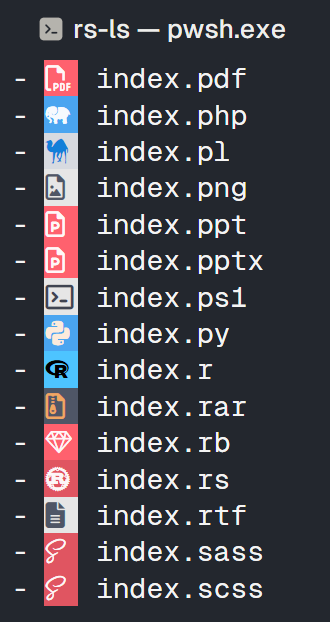
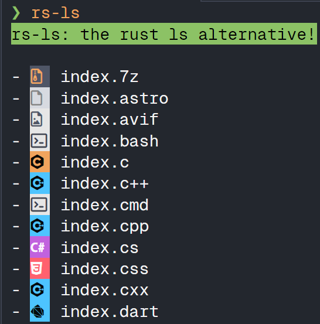
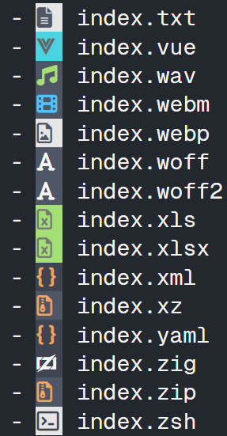

# rs-ls

I built this as a side project, which is bsically lsd but with background colors made possible by the colored crate.

If there are any extensions you would like to add, or if you want to change the color of a certain logo, or any other general improvements please open a PR.

Thank you for your support!
